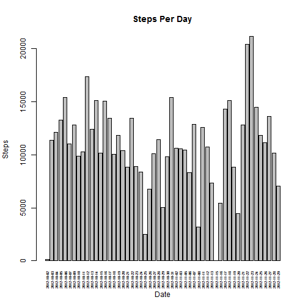
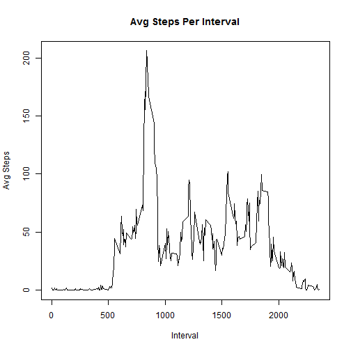
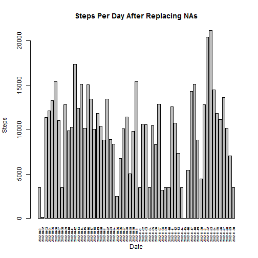
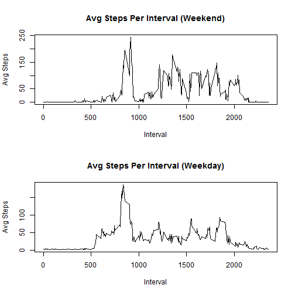

# Reproducible Research: Peer Assessment 1

Matthew Low

## Loading and preprocessing the data


```r
#Unzip file and extract its contents
td <- tempdir()
tf <- "activity.zip"
fname <- unzip(tf, list=TRUE)$Name[1]
unzip(tf, files=fname, exdir=td, overwrite=TRUE)
fpath <- file.path(td, fname)

#Data Frame with NA Values 
DataWithNA <- read.csv(fpath, header=TRUE, stringsAsFactors=FALSE)
DataWithNA$date <- as.Date(DataWithNA$date,"%Y-%m-%d")

#Data Frame without NA Values
DataWithoutNA <- DataWithNA[is.na(DataWithNA$steps)==FALSE,]
DataWithoutNA$date <- as.Date(DataWithoutNA$date,"%Y-%m-%d")
```

## What is mean total number of steps taken per day?


```r
#Calculate steps per day
StepsPerDay <- setNames(aggregate(DataWithoutNA$steps, list(date = DataWithoutNA$date), FUN = sum), c("Date","Sum"))
barplot(StepsPerDay$Sum, names = StepsPerDay$Date, xlab = "Date", ylab = "Steps", main = "Steps Per Day", las = 3, cex.names = .5)
```

 


```r
#Calculate mean for all days
Mean <- mean(StepsPerDay$Sum)
Mean <- format(Mean, digits = 5, big.mark = ",")
```

Mean = 10,766


```r
#Calculate median for all days
Median <- median(StepsPerDay$Sum)
Median <- format(Median, digits = 5, big.mark = ",")
```

Median = 10,765

## What is the average daily activity pattern?


```r
AvgStepsPerInterval <- setNames(aggregate(DataWithoutNA$steps, list(interval = DataWithoutNA$interval), FUN = mean), c("Interval","Avg"))
plot(AvgStepsPerInterval$Interval, AvgStepsPerInterval$Avg, type = "l", xlab = "Interval", ylab = "Avg Steps", main = "Avg Steps Per Interval")
```

 

```r
#Find interval with max steps
MaxInterval <- with(AvgStepsPerInterval, AvgStepsPerInterval$Interval[AvgStepsPerInterval$Avg == max(AvgStepsPerInterval$Avg)])
```

The 5-minute interval, on average across all the days in the dataset, which contains the maximum number of steps = 835

## Imputing missing values


```r
#Count number of records with NA
NARows <- DataWithNA[is.na(DataWithNA$steps),]
NumOfNA <- nrow(NARows)
NumOfNA <- format(NumOfNA, digits = 4, big.mark = ",")
```

Total number of missing values in the dataset = 2,304


```r
#Replace all NAs with a value of 12
DataWithNA$steps[is.na(DataWithNA$steps)] <- 12
```


```r
#Calculate steps per day after replacing NAs with 12
StepsPerDayReplace <- setNames(aggregate(DataWithNA$steps, list(date = DataWithNA$date), FUN = sum), c("Date","Sum"))
barplot(StepsPerDayReplace$Sum, names = StepsPerDayReplace$Date, xlab = "Date", ylab = "Steps", main = "Steps Per Day After Replacing NAs", las = 3, cex.names = .5)
```

 


```r
#Calculate mean after replacement
MeanReplace <- mean(StepsPerDayReplace$Sum)
MeanReplace <- format(MeanReplace, digits = 5, big.mark = ",")
```

Mean after replacement = 9,807.5


```r
#Calculate median after replacement
MedianReplace <- median(StepsPerDayReplace$Sum)
MedianReplace <- format(MedianReplace, digits = 5, big.mark = ",")
```

Median after replacement= 10,395

- Mean before replacement = 10,766
- Mean after replacement = 9,807.5
- Median before replacement = 10,765
- Median after replacement = 10,395
- Since I replaced all NAs with a value of 12, it had a significant impact on the Mean and as a result, the mean greatly decreased.  The median was also lower after replacing the NAs with 12's but the impact was not as much.

## Are there differences in activity patterns between weekdays and weekends?


```r
#Find Weekday or Weekend for date
DataWithNA <- cbind(DataWithNA, weekdays(DataWithNA$date))
colnames(DataWithNA)[4] <- "Day"
DataWithNA <- cbind(DataWithNA, "x")
colnames(DataWithNA)[5] <- "WeekdayOrWeekend"

DataWithNA$Day <- as.character(DataWithNA$Day)
DataWithNA$WeekdayOrWeekend <- as.character(DataWithNA$WeekdayOrWeekend)

for (i in 1:nrow(DataWithNA)){
  if(DataWithNA[i,4] == "Saturday" || DataWithNA[i,4] == "Saturday")
    {DataWithNA[i,5] <- "Weekend"}
  else
    {DataWithNA[i,5] <- "Weekday"}
}

#Create a data frame for Weekend date only and Weekday data only
DataWeekend <- DataWithNA[DataWithNA$WeekdayOrWeekend == "Weekend",]
AvgStepsPerIntervalWeekend <- setNames(aggregate(DataWeekend$steps, list(interval = DataWeekend$interval), FUN = mean), c("Interval","Avg"))
DataWeekday <- DataWithNA[DataWithNA$WeekdayOrWeekend == "Weekday",]
AvgStepsPerIntervalWeekday <- setNames(aggregate(DataWeekday$steps, list(interval = DataWeekday$interval), FUN = mean), c("Interval","Avg"))
```


```r
par(mfrow = c(2,1))
plot(AvgStepsPerIntervalWeekend$Interval, AvgStepsPerIntervalWeekend$Avg, type = "l", xlab = "Interval", ylab = "Avg Steps", main = "Avg Steps Per Interval (Weekend)")
plot(AvgStepsPerIntervalWeekday$Interval, AvgStepsPerIntervalWeekday$Avg, type = "l", xlab = "Interval", ylab = "Avg Steps", main = "Avg Steps Per Interval (Weekday)")
```

 
